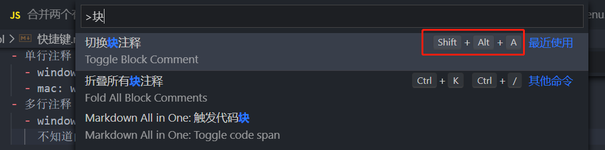

- [部分快捷键](https://juejin.cn/post/6844903693741981709)
- 注释（注释和取消注释同样快捷键）
  - 单行注释

    - window:  ctrl + /

    - mac:  win + /

  - 多行注释

    - window/mac: Shift + Alt + A 
      不知道的话可以打开命令面板（ctrl/command + shift + p）, 输入块搜索

      

    - mac: 待补充

